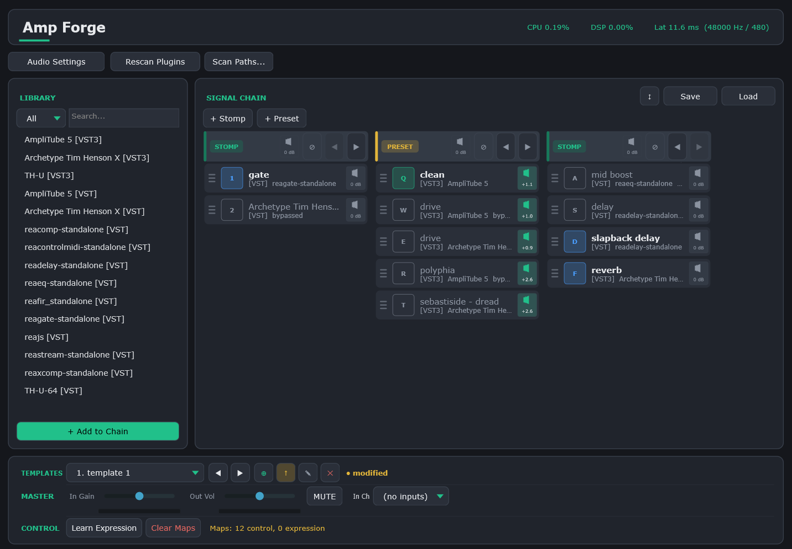

<h1 align="center">Amp Forge</h1>

<p align="center">
  A free, open-source VST3/VST2 plugin host for guitarists on Windows.<br/>
  Build a pedalboard in software, assign MIDI footswitches, and perform live — no DAW needed.
</p>

<p align="center">
  <a href="https://github.com/sakku116/ampforge/releases/tag/v0.3.0"></a>
  
  
  <a href="LICENSE"></a>
</p>

<p align="center">
  <a href="https://github.com/sakku116/ampforge/releases/tag/v0.3.0"><strong>⬇ Download v0.3.0 (Windows, portable ZIP)</strong></a>
</p>

---



*Horizontal chain view — stomp, preset, and stomp sections laid out side by side. Toggle between vertical and horizontal via the ↔/↕ button.*

---

Amp Forge is a standalone guitar multi-effects host. Load any VST3 or VST2 plugin, chain them in whatever order you want, and play through your audio interface with near-zero latency on ASIO. Think of it as a software pedalboard — without the price tag, and without opening a DAW.

The main things that made it worth building:

- **Sections** split your chain into *Stomp* (independent bypass per slot) and *Preset* (exclusive — only one amp/cab active at a time, like switching channels on a real amp). Most generic hosts don't have this.
- **Templates** let you save complete chain snapshots and switch between them with a single keypress or MIDI footswitch.
- **Plugin scanning runs in a subprocess**, so a crashing plugin can't take down your session.

---

## Features

**Signal chain**
- VST3 and VST2 hosting — scans standard plugin folders on startup, or add your own via Scan Paths
- Drag and drop to reorder effects
- Per-slot bypass and per-slot volume trim
- Per-section bypass and per-section output level

**Live performance**
- Templates — save and recall named chain configurations (think "verse", "chorus", "lead")
- MIDI control mapping — bind any note, CC, or program change to a bypass toggle or preset switch
- Keyboard controls — local shortcuts plus optional Global Keys capture for mapped bare keys outside the app
- Expression pedal — map a MIDI CC to any plugin parameter

**Audio**
- ASIO support for ultra-low latency
- Master input gain, output volume, and global mute
- CPU and DSP usage in the header (always visible)

**Presets**
- Save and load `.tfpreset` files — full chain snapshots including plugin state

---

## Getting started

1. **[Download the latest release](https://github.com/sakku116/ampforge/releases/tag/v0.3.0)** and extract the ZIP anywhere
2. Run `Amp Forge.exe`
3. Open **Audio Settings** and pick your interface (ASIO strongly recommended)
4. VST3 plugins in standard locations show up automatically in the Library — for other folders, use **Scan Paths...**
5. Drag a plugin into the Signal Chain and play

Full guide: [docs/USER_GUIDE.md](docs/USER_GUIDE.md)

---

## Build from source

### Requirements

- Windows 10 or 11
- Visual Studio 2022 or 2026 with *Desktop development with C++*
- CMake 3.22+
- Internet on first configure (JUCE 8 fetched automatically via CMake)

ASIO and VST2 SDKs are bundled — nothing extra to download.

### Steps

```powershell
git clone https://github.com/sakku116/ampforge/guitar-multifx-simulator
cd guitar-multifx-simulator

# Visual Studio 2026
cmake -S . -B build -G "Visual Studio 18 2026" -A x64

# Visual Studio 2022 — use "Visual Studio 17 2022" instead

cmake --build build --config Release --parallel
```

Makefile shortcuts if you prefer:

```powershell
make build    # Debug build
make release  # Release build
make run      # Build + run
```

Output: `build/AmpForge_artefacts/Release/Amp Forge.exe`

> `Amp Forge.exe` and `AmpForgeScanWorker.exe` need to be in the same folder. CMake handles this automatically after each build.

---

## Troubleshooting

| Symptom | What to try |
|---|---|
| Plugins not showing up | Click **Rescan Plugins**, or add your plugin folder via **Scan Paths...** |
| No audio | Open **Audio Settings** and check your input/output device selection |
| High latency | Switch to ASIO and lower the buffer size in Audio Settings |
| "Couldn't open input device" | Make sure your interface is connected before launching, or open Audio Settings after |
| Plugin crashes during scan | This is expected — crashes are isolated per-plugin. Check `%APPDATA%\AmpForge\host.log` for details |

---

## Project layout

```
src/           C++ source — audio engine, plugin host, UI
docs/          User guide + screenshots
ASIOSDK/       Steinberg ASIO SDK 2.3 (bundled)
vst2sdk/       VST2 interface headers (bundled, MIT clean-room)
CMakeLists.txt Build config
Makefile       Build shortcuts
```

---

## License

This project is licensed under **AGPLv3** — see [LICENSE](LICENSE).

| Component | License |
|---|---|
| Amp Forge | [AGPLv3](LICENSE) |
| JUCE 8 | AGPLv3 option — [juce.com](https://juce.com/get-juce/) |
| Steinberg ASIO SDK 2.3 | GPL v3 — [ASIOSDK/LICENSE.txt](ASIOSDK/LICENSE.txt) |
| VST2 interface headers | MIT — [vst2sdk/LICENSE](vst2sdk/LICENSE) |
| Steinberg VST3 SDK | MIT (bundled via JUCE/CMake) |

**VST2 note:** The bundled VST2 headers are a clean-room reimplementation of the binary ABI, not derived from Steinberg's source. Hosting VST2 plugins for interoperability purposes is generally permitted under US DMCA § 1201(f) and EU Software Directive Article 6(2). "VST" is a trademark of Steinberg Media Technologies GmbH. This project is not affiliated with or endorsed by Steinberg.
